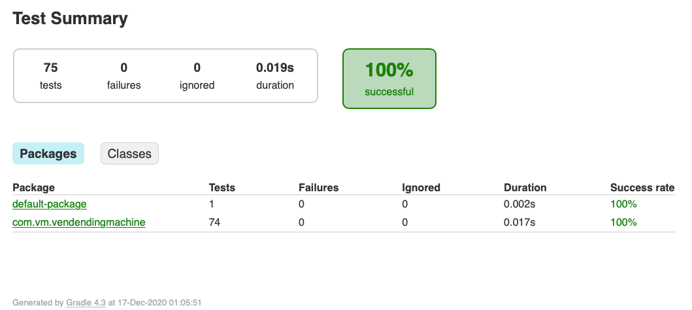
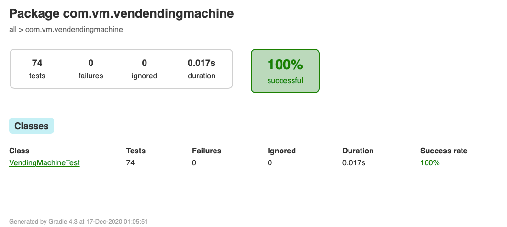
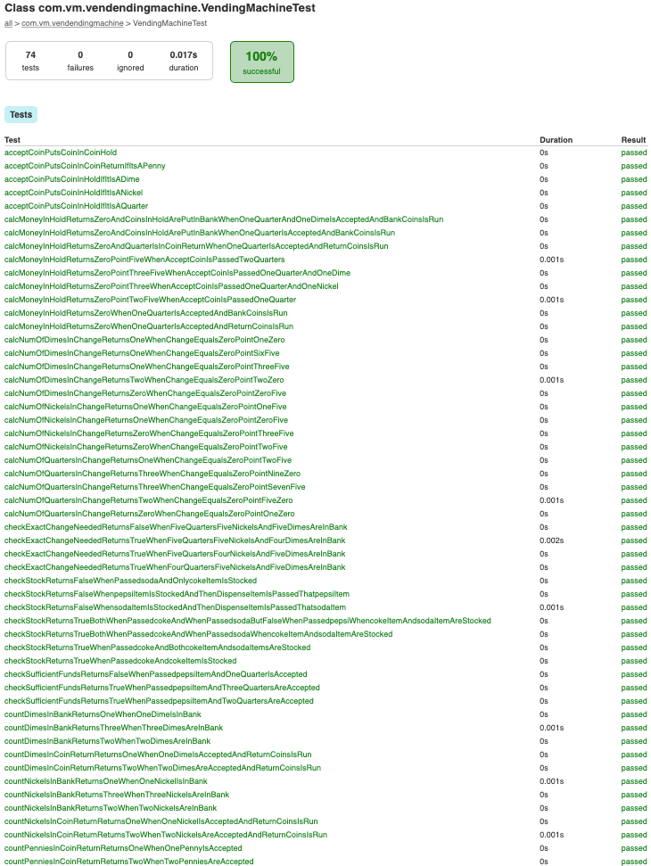

# Vending Machine
This is a test program to simulate Vending Machine application.

|                  |                           |
| ---------------- | -------------------------:|
| Code:            |                    Java 9 |
| Build:           |              Gradle 4.2.1 |
| Test coverage:   |                     JUnit |
| IDE:             |              Intellij IDE |

To build:

    $ gradle build

The following are implemented as part of the test application :
1.    Accepts coins of 1,5,10,25 Cents i.e. penny, nickel, dime, and quarter.
2.    Allow user to select products Coke(25), Pepsi(35), Soda(45)
3.    Allow user to take refund by cancelling the request.
4.    Return selected product and remaining change if any.
5.    Allow reset operation for vending machine supplier.

To Test :

    $ gradle test

Gradle test will run all the junit test cases.

Sample Junit test reports : 

